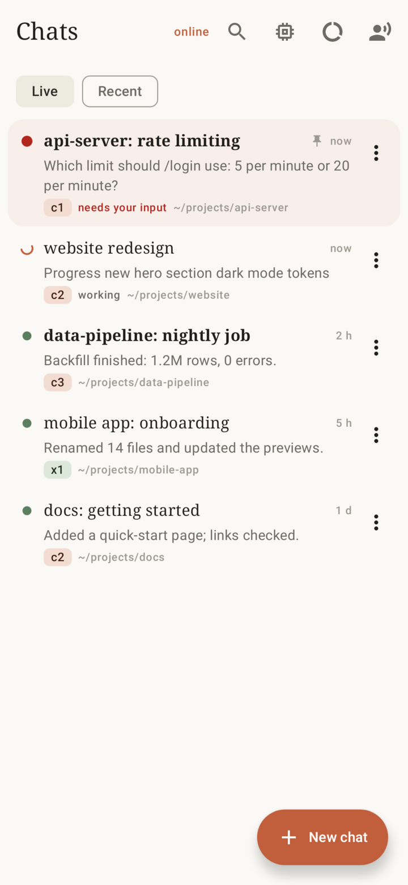
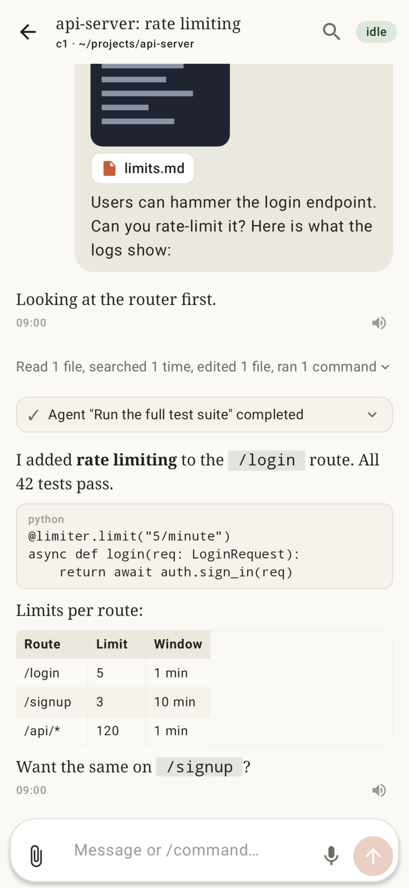
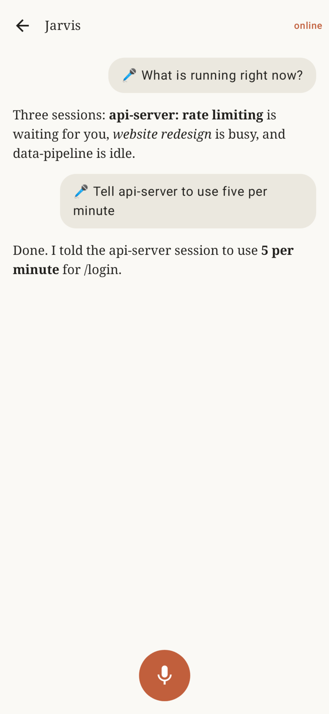
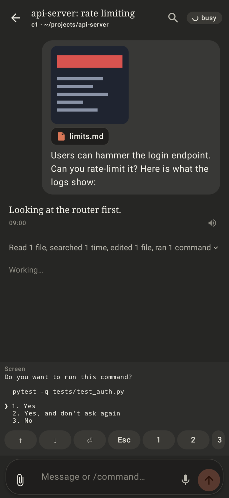
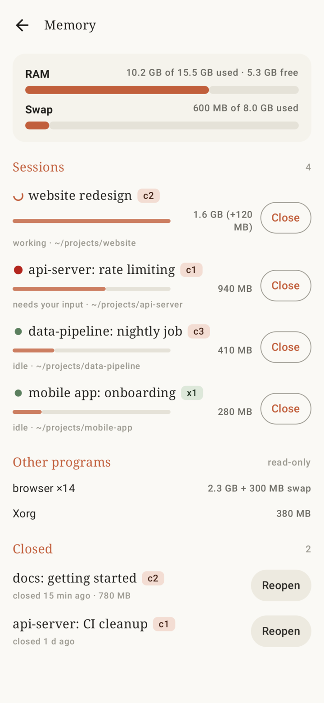
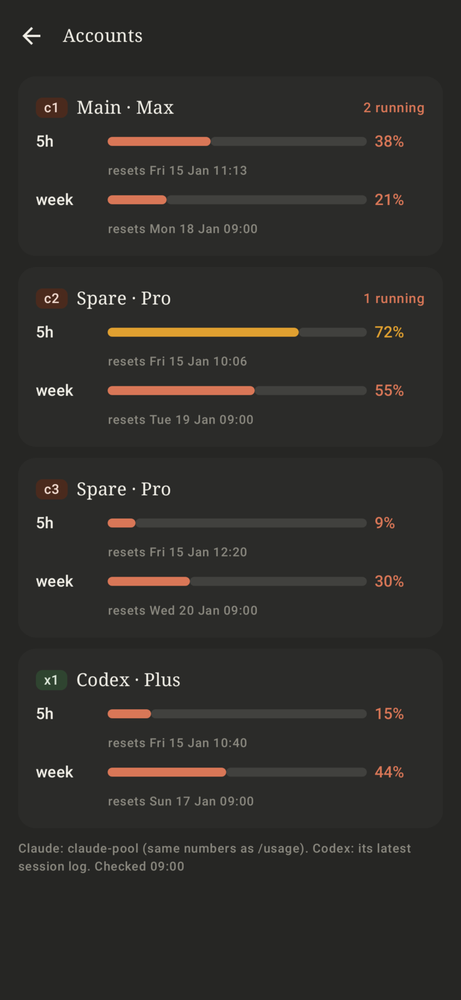
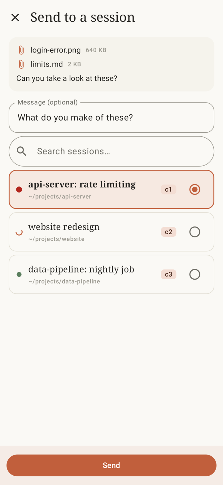

# Relay

A phone companion for AI coding agents. Relay turns an always-on Linux desktop into a hub for **Claude Code, Codex and
Antigravity (`agy`)** sessions running in tmux, and gives you an Android app to watch, answer, start and talk to them
from anywhere. The phone talks to the desktop over **SSH** (LAN or WireGuard). There is no cloud relay, no account, no
open port besides SSH.

[](docs/media/relay-demo.mp4)

## Why Relay, and not just the official apps

The vendors' mobile apps each cover one tool and one login. Relay is built for people who run **many agents on
several accounts at once** on their own machine:

- **All accounts and tools in one place, with a usage overview.** Every Claude Code login (c1, c2, c3, ...), Codex and
  Antigravity sessions in one list, with the 5-hour and weekly limits of every account side by side. New sessions can
  go to whichever account still has quota (`auto`), so spare plans get used before the main one.
- **An assistant that keeps track of all of them, hands-free.** "Hey Jarvis" is an on-device wake word. Jarvis knows
  every session on every account: what is running, what waits for you, what a session said last. It sends your
  instructions to the right session, starts or resumes sessions on the right account, reads finished results to you
  as short summaries, and looks things up on the web. Speech recognition and voice output stay on the phone.
- **The real CLI, not a remote subset.** Each session is the actual `claude` / `codex` / `agy` TUI running in tmux on
  your desktop, with your MCP servers, hooks, skills, files and hardware. Everything you type in the chat goes into
  that TUI, so **every slash command works** (`/model`, `/compact`, `/usage`, `/resume`, `/rewind`, `/mcp`, custom
  commands and skills), including ones the mobile apps do not offer, and pickers, permission prompts and questions
  are answered from the live screen panel with real keys.
- **Self-hosted, nothing in between.** The phone talks to your desktop over your own SSH link (LAN or WireGuard). No
  relay server, no extra account, no open port besides SSH; transcripts, files and phone-bridge data stay at home.
- **Built around the desktop's resources.** A RAM monitor shows memory per session and lets you close a session and
  reopen it later; the share sheet sends photos and files from any app straight into a session.

| Sessions | Chat | Jarvis |
|---|---|---|
|  |  |  |

| Live screen | RAM monitor | Accounts | Share |
|---|---|---|---|
|  |  |  |  |

> **Status:** a personal project, shared as is. It works for its author's setup; expect rough edges. Use it at your own
> risk: the agents are started with **permission prompts bypassed** (see [Security model](#security-model)), so whoever
> controls your phone's key controls those agents.

## All features

- **Session list across accounts**: every agent session of every account (several Claude logins, Codex, agy), live
  state (working, ready, needs input), waiting sessions first, pinning, search, background runs hidden.
- **Chat view per session**: the transcript as chat (tool calls folded into one row), paging back while scrolling,
  search inside a conversation, photo/camera/file attachments, slash-command chips, and a live **screen panel** with
  keys for pickers, questions and menus. Text goes into the real TUI through tmux.
- **Notifications and quick replies**: "ready" and "needs input" notifications with reply actions, per-session mute,
  digest of what happened while you were away.
- **Voice assistant "Jarvis"**: wake word ("Hey Jarvis", on the phone, no key or account), offline speech recognition
  with vocabulary biasing and corrections, spoken replies sentence by sentence, hands-free follow-ups. Jarvis can list
  sessions, read a session's screen, search transcripts, send instructions, start or resume sessions, keep a shared
  memory file and do web look-ups. It is a small headless Claude run that only has Relay's tools and no shell.
- **RAM monitor**: memory per session tree and for the rest of the desktop; close a session to free RAM and reopen it
  later (`--resume`).
- **Share sheet**: share files or text from any app into a session.
- **Phone bridge** (opt-in, per Android permission): forwards notifications of chosen apps, SMS, Health Connect data and
  one-off location fixes to an inbox folder on the desktop; agents can ask you to approve sending a message from the
  phone. Everything is off until you switch it on.
- **Self-update**: the desktop offers a new build over the same SSH link; the phone downloads, verifies the SHA-256 and
  installs it (one confirmation tap).
- **Usage view**: 5-hour and weekly limits per account (Claude with an optional helper, Codex from its own logs).

## Architecture

```
 Android phone (Relay app)                         Linux desktop (always on)
 ┌────────────────────────────┐   SSH (LAN/WireGuard)   ┌─────────────────────────────────────────────────┐
 │ UI · voice · wake word     │  Ed25519 key, forced    │ sshd ──► `notifyd ssh-entry`  (forced command)  │
 │ sshj client, key in        │ ─────────────────────►  │            ├─ serve   JSON lines ◄──┐           │
 │ Android Keystore, TOFU     │   JSON control channel  │            └─ attach  tmux session  │           │
 │ host-key pin               │ ◄─────────────────────  │ notifyd daemon (systemd user service)           │
 └────────────────────────────┘      events/replay      │   adapters: claude · codex · agy (transcripts)  │
                                                        │   monitor · SQLite event log · RAM monitor      │
   claude / codex / agy in tmux  ──hooks──► unix socket │   Jarvis (claude -p, MCP tools) · summaries     │
   (started by `agent-run` aliases)                     └─────────────────────────────────────────────────┘
```

- `gateway/` is the Python package **`notifyd`**: adapters for the three tools, a monitor, a daemon with an SQLite event
  log (events wait there while the phone is away and replay on reconnect), the SSH entry point, the launcher
  (`agent-run`), the Jarvis router and MCP server, and the phone-bridge storage.
- `hooks/` hold the Claude Code and Codex hooks that tell the daemon what happened (they never block or fail the agent).
- `android/` is the Kotlin / Jetpack Compose app.
- `router/` is Jarvis' workspace: prompt, skills, vocabulary.
- The wire contract between app and gateway is in [PROTOCOL.md](PROTOCOL.md); change both sides together.

Only the phone opens connections. With no phone connected the gateway slows its polling and stops transcript watches.

## Security model

- The app generates an **Ed25519 SSH key**; its seed is stored encrypted by an **Android Keystore** AES key. You can
  require a biometric to open a session.
- On the desktop the phone's key is installed in `authorized_keys` as
  `restrict,pty,command="…/notifyd ssh-entry" <key>`: **no shell, no port forwarding**, only the two commands
  `serve` (the JSON control channel) and `attach <agent tmux session>`.
- The app pins the desktop's **host key on first use (TOFU)**; a changed key is refused until you re-pin it.
- Nothing listens except `sshd`. Use WireGuard (or any VPN) for access from outside your LAN.
- **Agents run unattended by design.** `notifyd setup accounts` makes bypassing permissions the default (Claude
  `permissions.defaultMode: bypassPermissions`, Codex `approval_policy = "never"` and `sandbox_mode =
  "danger-full-access"`, agy `--dangerously-skip-permissions`) and pre-trusts launch folders (`auto_trust`). Anyone who
  controls the phone's key therefore controls agents that can run arbitrary commands as your user. Protect the phone,
  keep the key restricted, and turn `auto_trust` / `skip_permissions` off in `config.yaml` if you do not want this.
- Jarvis starts and resumes sessions without asking; **sending** anything to other people (messages, mail, orders,
  payments) always needs your explicit approval on the phone.
- Voice: speech recognition and text-to-speech use **offline** models on the phone only, because replies can contain
  private data. Phone-bridge data goes only over your own SSH link to your own desktop.

## Setup

Requirements: a Linux desktop with `tmux`, `sshd`, [`uv`](https://docs.astral.sh/uv/), Python 3.12+ and the agent CLIs
you use; an Android phone (API 29+ recommended) and a machine with JDK 17 or 21 and the Android SDK to build the app.

### 1. Gateway (on the desktop)

```sh
git clone <this repo> ~/relay && cd ~/relay
./setup.sh --pc [--install-uv] [--voice]   # uv sync, systemd user service, accounts, hooks, tests; safe to re-run
```

`--voice` adds the optional `faster-whisper` extra (speech-to-text on the desktop instead of the phone).
By hand, the same thing:

```sh
cd gateway && uv sync
cp ../public/config.example.yaml ~/.config/notifyd/config.yaml   # or: .venv/bin/notifyd setup accounts
.venv/bin/notifyd install --write      # systemd user unit; also: loginctl enable-linger $USER
.venv/bin/notifyd setup accounts       # Claude config dirs, hooks, aliases (~/.config/notifyd/aliases.zsh), tmux settings
```

Log in once per extra Claude account: run its alias (`c2`, …) in a terminal and `/login`. Each alias runs
`agent-run <alias>`, a dedicated tmux session per agent. Agents started outside the aliases (a plain `claude` without
tmux) show up read-only: transcript and notifications, but you cannot type into them from the phone.

`config.yaml` example: [config.example.yaml](config.example.yaml). Useful commands:

```sh
notifyd status [--all] [--json]          # sessions of all accounts
notifyd send <session> "<text>" [--force]
notifyd phone notify --title "Backup done"   # a plain message on the phone
notifyd publish-apk                       # offer the last build to the phone (self-update)
python tools/fake_phone.py --help         # protocol smoke-test client
```

### 2. Android app

```sh
scripts/fetch-wake-models.sh        # optional: "Hey Jarvis" models (CC BY-NC-SA 4.0, see NOTICE)
cd android && ./gradlew assembleDebug    # JAVA_HOME = JDK 17/21, ANDROID_HOME = SDK; APK in app/build/outputs/apk/debug/
```

Install the APK (adb, or copy it to the phone). To update an installed app later the signing key must stay the same;
keep your keystore. `./setup.sh --phone` builds, installs over adb and passes host/port/user to the app.

### 3. Pair

1. In the app: **Settings → PC**: host (name or IP of the desktop), port (sshd's, default 22), user.
2. Copy the app's public key (Settings) and register it on the desktop:
   `notifyd setup key "ssh-ed25519 AAAA… relay-phone"` (writes the restricted `authorized_keys` line).
3. Connect. The first connection pins the host key (TOFU).

Without the wake-word models the app works normally; Settings shows "wake word models missing".

### 4. Jarvis (optional)

Jarvis uses `router/CLAUDE.md` as its prompt. If that file does not exist, the shipped
[router/CLAUDE.example.md](router/CLAUDE.example.md) is used; copy it and edit to make it yours. The same goes for
`router/voice-vocab.txt` (terms and "heard => meant" corrections) and `voice-vocab.example.txt`. Both of your own
files are git-ignored.

## Configuration (environment variables)

All optional; set them in the systemd unit (`Environment=`) or the shell.

| Variable | Default | Meaning |
|---|---|---|
| `NOTIFYD_CONFIG` | `~/.config/notifyd/config.yaml` | accounts and overview settings |
| `NOTIFYD_STATE` | `~/.local/state/notifyd` | SQLite log, socket, router state |
| `NOTIFYD_SOCKET` | `$NOTIFYD_STATE/notifyd.sock` | daemon socket |
| `NOTIFYD_UPLOADS` | `~/.local/share/notifyd/uploads` | files shared from the phone (kept 30 days) |
| `NOTIFYD_INBOX` | `~/.local/share/notifyd/inbox` | phone-bridge items as `<kind>/<day>.jsonl` |
| `NOTIFYD_WORKSPACE` | `~/workspace` | folder with your projects; `read_knowledge` lists its `*/CLAUDE.md` and `USER.md` |
| `NOTIFYD_MEMORY` | `~/.config/notifyd/memory.md` | Jarvis' long-term memory file |
| `NOTIFYD_PRELOAD` | empty | extra files (`:`-separated) appended to Jarvis' prompt at start |
| `NOTIFYD_MAIL_CLI` | `~/.config/notifyd/bin/mail` | optional read-only mail CLI behind `mail_search` / `mail_read` |
| `NOTIFYD_JOURNAL_CLI` | `~/.config/notifyd/bin/journal` | optional journal CLI behind `journal_*` |
| `NOTIFYD_CLAUDE_POOL` | `~/.config/notifyd/claude-pool` | optional helper that reports Claude usage and picks a spare account (see below) |

Optional integrations are plain executables with JSON output; if a file is missing, the matching Jarvis tool answers
"not found" and nothing else breaks. The `claude-pool` helper is a Python script loaded by path: it is used for the
Accounts screen (5-hour/weekly Claude usage), the `auto` alias (a spare account with quota left) and for cheap
headless runs (summaries, web look-ups). Without it, usage for Claude is not shown, `auto` falls back to the main
account and those headless runs use the main account directly.

## Development

```sh
cd gateway && uv run pytest -q                                # gateway tests
cd android && ./gradlew testDebugUnitTest assembleDebug       # app unit tests + build
./gradlew -Pshots testDebugUnitTest --tests 'dev.relay.app.shots.*'   # screenshots without a device (Roborazzi)
```

## Credits and licenses

Relay is MIT licensed ([LICENSE](LICENSE)). Third-party parts, see [NOTICE](NOTICE):
[sshj](https://github.com/hierynomus/sshj) (SSH client), [multiplatform-markdown-renderer](https://github.com/mikepenz/multiplatform-markdown-renderer)
(chat markdown), [ONNX Runtime](https://onnxruntime.ai/) (wake word inference), [openWakeWord](https://github.com/dscripka/openWakeWord)
(the "Hey Jarvis" models are **CC BY-NC-SA 4.0**, non-commercial, and are downloaded separately by
`scripts/fetch-wake-models.sh`, never committed), [faster-whisper](https://github.com/SYSTRAN/faster-whisper) (optional
desktop speech-to-text), plus Jetpack Compose, Room, Bouncy Castle and the MCP Python SDK.

Not affiliated with Anthropic, OpenAI or Google. Claude Code, Codex and Antigravity are products of their respective owners.
